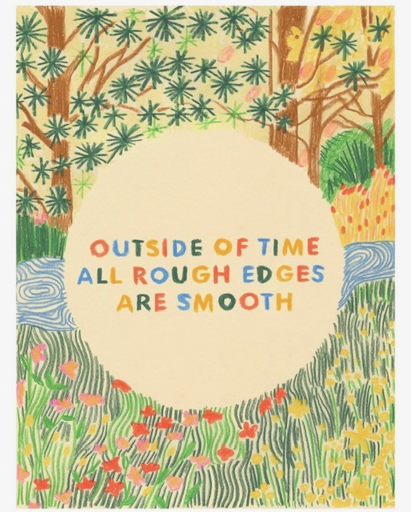
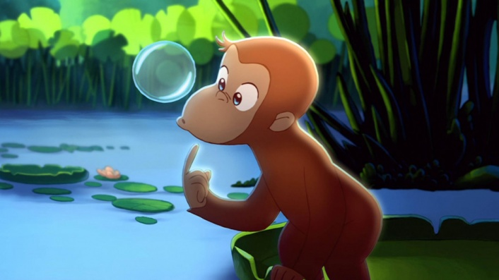

<!DOCTYPE html>
<html lang="en">
<head>
<meta charset="UTF-8">
<meta name="viewport" content="width=device-width, initial-scale=1.0">
<title>Image Carousel</title>

</head>

<body>

    

        

            
        

        

            
        

        

            
        

    

    <button class="prev" onclick="changeSlide(-1)">❮</button>
    <button class="next" onclick="changeSlide(1)">❯</button>

    

</body>
</html>
